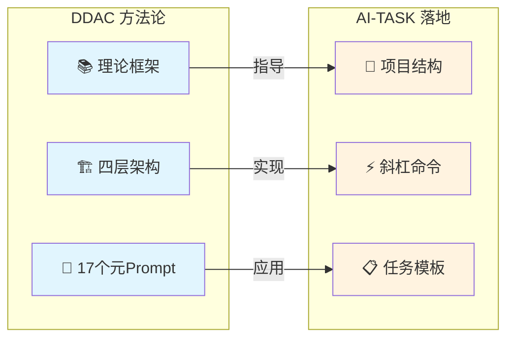
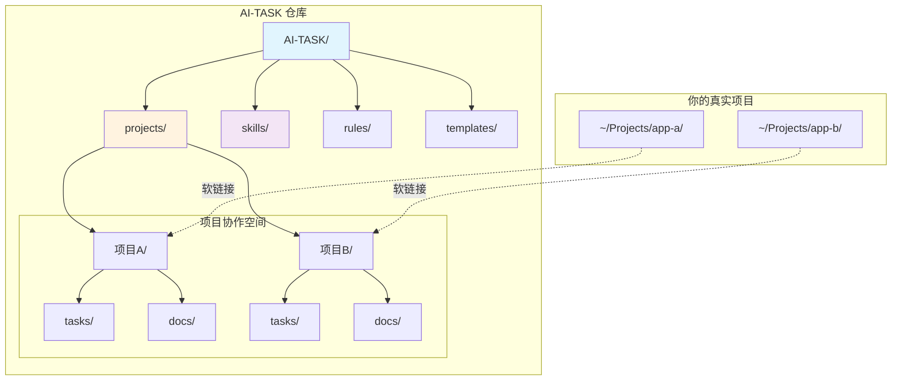
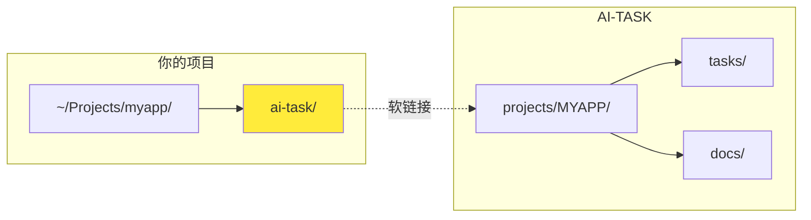

<div align="center">

# AI-TASK

**单人 · 多项目 · 跨设备的 AI 协作路书与任务管理系统**

[English](./README_EN.md) | 简体中文

[](https://github.com/ArnoFrost/AI-TASK/stargazers)
[](https://github.com/ArnoFrost/AI-TASK/network)
[](https://github.com/ArnoFrost/AI-TASK/commits)
[](LICENSE)
[](CHANGELOG.md)
[](https://github.com/ArnoFrost/DDAC)

<p>
  <a href="#-快速开始3-分钟">快速开始</a> •
  <a href="#-架构设计">架构</a> •
  <a href="#-可用命令">命令</a> •
  <a href="./SPEC.md">规范</a> •
  <a href="./CHANGELOG.md">更新日志</a>
</p>

</div>

---

<details>
<summary>📖 目录 / Table of Contents</summary>

- [30 秒体验](#-30-秒体验)
- [什么是 AI-TASK](#-什么是-ai-task)
- [核心概念](#-核心概念先理解这-3-个就够用了)
- [快速开始](#-快速开始3-分钟)
- [架构设计](#-架构设计)
- [目录结构](#-目录结构)
- [可用命令](#-可用命令)
- [软链接工作原理](#-软链接工作原理)
- [文档](#-文档)
- [已知局限](#️-已知局限保持小而美)
- [贡献](#-贡献)

</details>

---

## ⚡ 30 秒体验

**不想看文档？复制下面这段话发给你的 AI 助手：**

```
请帮我用 AI-TASK 规范创建一个任务文档：
- 项目代号：DEMO
- 标签：[功能]
- 任务名称：用户登录模块
- 目标：1. 登录表单 UI  2. 表单验证  3. API 对接

参考格式：https://github.com/ArnoFrost/AI-TASK/blob/main/projects/EXAMPLE/tasks/20260101-001_%5B功能%5D用户登录模块.md
```

AI 会生成一个标准化的任务文档 ✅ → 这就是 AI-TASK 的核心价值：**让 AI 按统一规范输出可复用的协作文档**

---

## 🎯 什么是 AI-TASK？

AI-TASK 是一套**面向 AI 协作的文件系统约定**：用统一的目录结构、任务模板、规则（Rules）与技能（Skills），把你在多个项目中的 AI 协作过程（目标、方案、验证、结论）沉淀为可复用的"路书"。

> 💡 **与 DDAC 的关系**：AI-TASK 是 [DDAC (Document-Driven AI Collaboration)](https://github.com/ArnoFrost/DDAC) 方法论的**落地实现**。DDAC 定义了"文档驱动 AI 协作"的理论框架与四层架构，而 AI-TASK 则是这套理念在"单人多项目任务管理"场景下的 MVP 实践。如果你想了解背后的设计哲学，请参阅 DDAC；如果你想直接上手使用，从这里开始。



它特别适合：**你一个人同时维护多个项目**，并且会在多台设备之间切换（例如 iCloud/云盘同步），希望 AI 在任何项目里都能"按同一套路"创建任务、更新进度、查看状态。

### 核心特性

| 特性 | 描述 |
|:---:|---|
| 🗂️ | **跨项目协作空间** - 每个项目在 `projects/{CODE}/` 下独立管理 |
| 🔗 | **软链接集成** - 通过 `ai-task/` 无侵入式接入现有项目 |
| 📱 | **跨设备同步** - `project.yaml` 支持多设备路径映射 |
| 🤖 | **AI 原生** - 内置 CodeBuddy/Claude Code 斜杠命令 |
| 📐 | **模板驱动** - 统一任务模板，输出可控可复用 |

### 适用 / 不适用

- **适用**：单人（或极小团队）、多项目并行、跨设备切换、愿意用 Markdown 记录方案/验证/总结。
- **不适用**：强依赖看板/通知/权限/指派的团队协作；需要在线平台级的统计与工作流编排。

---

## 🧠 核心概念（先理解这 3 个就够用了）

- **`projects/{CODE}/`**：每个项目的"协作空间"（任务、文档、归档、元数据）。你可以把它理解为：从主仓模板派生出来的项目空间，彼此隔离但共享同一套规范。
- **`ai-task/` 软链接**：挂载点。把 `projects/{CODE}/` 软链接到你的真实项目根目录下，AI 在任何项目里都能通过固定路径访问任务与规范。
- **`project.yaml` 跨设备路径**：记录同一项目在不同设备上的真实路径（按优先级排序），用于跨设备迁移与定位。

### 🔄 DDAC 自治理

AI-TASK 遵循 [DDAC 方法论](https://github.com/ArnoFrost/DDAC) 的自治理原则：

| 原则 | 说明 |
|------|------|
| **项目自治空间** | `projects/{PROJECT}/` 管理自身任务 |
| **任务必须沉淀** | 讨论产生的计划 → `tasks/` 任务文档 |
| **状态必须更新** | 任务完成 → 更新 `index.md` 任务列表 |

**任务沉淀触发条件**（满足任一即创建任务）：
- 用户提出多步骤优化/改进计划
- 用户引入 `@projects/{PROJECT}/index.md` 上下文
- 讨论涉及 3+ 个文件修改
- 用户说"梳理"、"规划"、"方案"等关键词

详见 [SPEC.md#ddac-自治理规范](./SPEC.md#-ddac-自治理规范)

---

## 🚀 快速开始（3 分钟）

### 1. 克隆仓库

```bash
git clone https://github.com/ArnoFrost/AI-TASK.git ~/AI-TASK
```

### 2. 初始化一个项目协作空间

```bash
cd ~/AI-TASK
./init-project.sh MYAPP "我的应用" "/Users/xxx/Projects/myapp" "React, TypeScript"

# 或使用交互模式
./init-project.sh
```

这会创建：

- `projects/MYAPP/`（含 `project.yaml`、`index.md`、`tasks/`、`docs/`）
- 可选：在你的项目根目录生成 `ai-task/` 软链接
- 可选：生成 IDE 配置（Claude Code / CodeBuddy）

### 3. 在 AI 助手中使用命令

```
/task create [功能] 用户登录模块
/task list
/status
```

---

## 📐 架构设计



---

## 📂 目录结构

```text
AI-TASK/
├── README.md                 # 本文件
├── README_EN.md              # English version
├── SPEC.md                   # 完整规范
├── init-project.sh           # 项目初始化脚本
├── projects/                 # 项目协作空间目录
│   └── {PROJECT}/
│       ├── project.yaml      # 项目元数据（含跨设备路径）
│       ├── index.md          # 项目入口
│       ├── tasks/            # 任务文件
│       ├── docs/             # 文档目录
│       └── archive/          # 归档目录（可选）
├── skills/                   # AI 技能定义
├── rules/                    # 项目规则
├── templates/                # 模板库
│   ├── claude/               # Claude Code 模板
│   └── codebuddy/            # CodeBuddy 模板
└── .codebuddy/commands/      # CodeBuddy 斜杠命令
```

---

## 🔧 可用命令

| 命令 | 说明 |
|------|------|
| `/init_sub_project CODE` | 在仓库中创建新项目 |
| `/task create [标签] 名称` | 创建新任务 |
| `/task list` | 列出所有任务 |
| `/task done 编号` | 标记任务完成 |
| `/archive 编号` | 归档已完成任务 |
| `/status` | 查看项目状态 |

---

## 📋 任务标签

| 标签 | 用途 | 标签 | 用途 |
|------|------|------|------|
| `[功能]` | 新功能 | `[优化]` | 性能优化 |
| `[修复]` | Bug 修复 | `[排查]` | 问题分析 |
| `[文档]` | 文档编写 | `[调研]` | 技术调研 |
| `[技术方案]` | 方案设计 | `[规范]` | 规范制定 |

---

## 🔗 软链接工作原理



初始化后，你的项目会有一个 `ai-task/` 软链接指向 `AI-TASK/projects/{CODE}/`。这样可以：

- AI 助手通过 `ai-task/tasks/` 访问任务文件
- 无侵入式集成（只有一个软链接）
- 在多个项目间复用同一套协作模板与规范

---

## 📖 文档

- [完整规范](./SPEC.md) - 系统完整规范
- [技能指南](./skills/) - 可用的 AI 技能
- [规则指南](./rules/) - 项目规则系统

---

## ⚠️ 已知局限（保持小而美）

- **跨设备同步的一致性**：尽量避免在两台设备上同时编辑同一个任务文件；如果云盘产生冲突副本，以任务编号为准手动合并。
- **软链接的跨平台差异**：macOS/Linux 体验最好；Windows 可能需要额外权限/模式。
- **这不是团队任务平台**：AI-TASK 更偏"个人工作台 + 路书沉淀"，不提供看板/权限/指派等平台能力。

---

## 🤝 贡献

欢迎贡献！请随时提交 Pull Request。

## 📄 许可证

本项目采用 MIT 许可证 - 详见 [LICENSE](LICENSE) 文件。

## 📝 更新日志

查看 [CHANGELOG.md](CHANGELOG.md) 了解版本历史与更新内容。

---

<div align="center">

Made with ❤️ by [ArnoFrost](https://github.com/ArnoFrost)

[](https://github.com/ArnoFrost)

</div>
