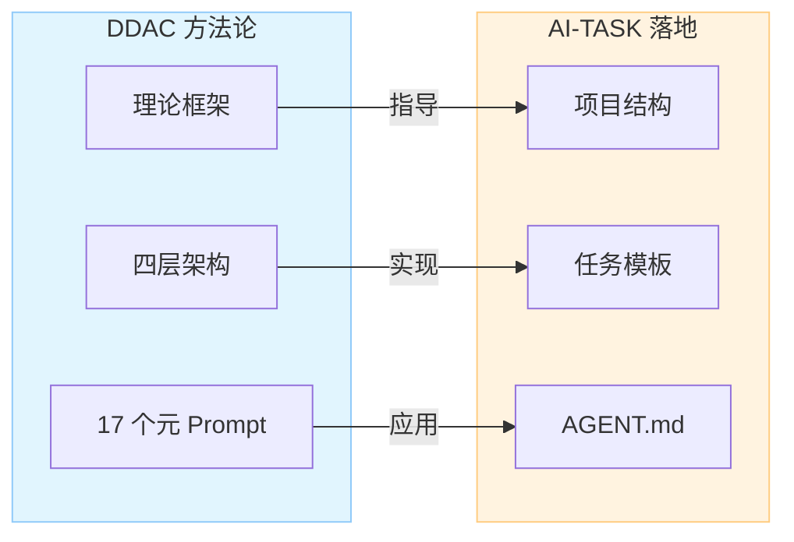
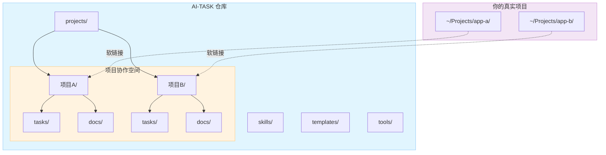
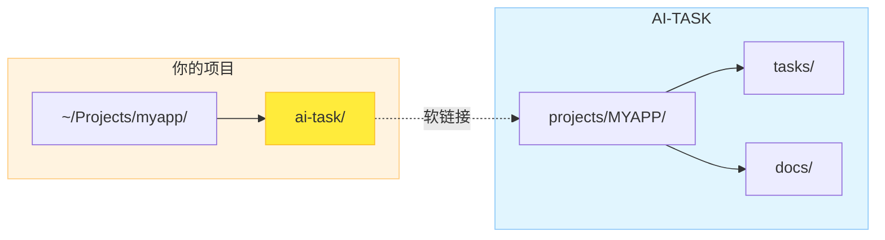

<div align="center">

# AI-TASK

**单人 · 多项目 · 跨设备的 AI 协作路书与任务管理系统**

[English](./README_EN.md) | 简体中文

[](https://github.com/ArnoFrost/AI-TASK/stargazers)
[](https://github.com/ArnoFrost/AI-TASK/network)
[](https://github.com/ArnoFrost/AI-TASK/commits)
[](LICENSE)
[](CHANGELOG.md)
[](https://github.com/ArnoFrost/DDAC)

<p>
  <a href="#-快速开始3-分钟">快速开始</a> •
  <a href="#-架构设计">架构</a> •
  <a href="./SPEC.md">规范</a> •
  <a href="./CHANGELOG.md">更新日志</a>
</p>

</div>

---

<details>
<summary>📖 目录 / Table of Contents</summary>

- [30 秒体验](#-30-秒体验)
- [什么是 AI-TASK](#-什么是-ai-task)
- [核心概念](#-核心概念先理解这-3-个就够用了)
- [快速开始](#-快速开始3-分钟)
- [架构设计](#-架构设计)
- [目录结构](#-目录结构)
- [任务标签](#-任务标签)
- [软链接工作原理](#-软链接工作原理)
- [文档](#-文档)
- [已知局限](#️-已知局限保持小而美)
- [贡献](#-贡献)

</details>

---

## ⚡ 30 秒体验

**零摩擦使用：只需引入项目入口，然后描述任务**

```
步骤1: 在对话中引入 @projects/EXAMPLE/index.md
步骤2: 告诉 AI "帮我实现用户登录功能"
步骤3: 完成 ✅ AI 自动创建任务文档、执行、更新状态
```

**AI 自动完成：**
- 📝 任务命名编号（`20260112-001_[功能]用户登录.md`）
- 🏷️ 标签判断（功能/优化/修复/排查...）
- 📊 状态更新（更新 index.md 任务列表）

> 💡 你只需要描述"做什么"，其他全部自动化

---

**想先看效果？** 查看示例项目：[projects/EXAMPLE/](./projects/EXAMPLE/)（含进行中任务 + 归档示例）

---

## 🎯 什么是 AI-TASK？

AI-TASK 是一套**面向 AI 协作的文件系统约定**：用统一的目录结构、任务模板、规则（Rules）与技能（Skills），把你在多个项目中的 AI 协作过程（目标、方案、验证、结论）沉淀为可复用的"路书"。

> 💡 **与 DDAC 的关系**：AI-TASK 是 [DDAC (Document-Driven AI Collaboration)](https://github.com/ArnoFrost/DDAC) 方法论的**落地实现**。DDAC 定义了"文档驱动 AI 协作"的理论框架与四层架构，而 AI-TASK 则是这套理念在"单人多项目任务管理"场景下的 MVP 实践。如果你想了解背后的设计哲学，请参阅 DDAC；如果你想直接上手使用，从这里开始。


```mermaid
graph LR
    subgraph DDAC["DDAC 方法论"]
        D1["理论框架"]
        D2["四层架构"]
        D3["17 个元 Prompt"]
    end

    subgraph AITASK_IMPL["AI-TASK 落地"]
        A1["项目结构"]
        A2["任务模板"]
        A3["AGENT.md"]
    end

    D1 -->|指导| A1
    D2 -->|实现| A2
    D3 -->|应用| A3

    style DDAC fill:#e1f5fe,stroke:#90caf9
    style AITASK_IMPL fill:#fff3e0,stroke:#ffcc80
```

它特别适合：**你一个人同时维护多个项目**，并且会在多台设备之间切换（例如 iCloud/云盘同步），希望 AI 在任何项目里都能"按同一套路"创建任务、更新进度、查看状态。

### 核心特性

| 特性 | 描述 |
|:---:|---|
| 🗂️ | **跨项目协作空间** - 每个项目在 `projects/{CODE}/` 下独立管理 |
| 🔗 | **软链接集成** - 通过 `ai-task/` 无侵入式接入现有项目 |
| 📱 | **跨设备同步** - `project.yaml` 支持多设备路径映射 |
| 🤖 | **多 IDE 适配** - 支持 Claude Code / CodeBuddy / Cursor / 通用 AGENT.md |
| 📐 | **模板驱动** - 统一任务模板，输出可控可复用 |

### 适用 / 不适用

- **适用**：单人（或极小团队）、多项目并行、跨设备切换、愿意用 Markdown 记录方案/验证/总结。
- **不适用**：强依赖看板/通知/权限/指派的团队协作；需要在线平台级的统计与工作流编排。

---

## 🧠 核心概念（先理解这 3 个就够用了）

- **`projects/{CODE}/`**：每个项目的"协作空间"（任务、文档、归档、元数据）。你可以把它理解为：从主仓模板派生出来的项目空间，彼此隔离但共享同一套规范。
- **`ai-task/` 软链接**：挂载点。把 `projects/{CODE}/` 软链接到你的真实项目根目录下，AI 在任何项目里都能通过固定路径访问任务与规范。
- **`project.yaml` 跨设备路径**：记录同一项目在不同设备上的真实路径（按优先级排序），用于跨设备迁移与定位。

### 🔄 DDAC 自治理

AI-TASK 遵循 [DDAC 方法论](https://github.com/ArnoFrost/DDAC) 的自治理原则：

| 原则 | 说明 |
|------|------|
| **项目自治空间** | `projects/{PROJECT}/` 管理自身任务 |
| **任务必须沉淀** | 讨论产生的计划 → `tasks/` 任务文档 |
| **状态必须更新** | 任务完成 → 更新 `index.md` 任务列表 |

**自动化行为**（引入 `index.md` 后 AI 自动执行）：
- 用户描述需求 → 自动创建任务文档
- 自动命名编号 → `{DATE}-{SEQ}_[标签]名称.md`
- 自动判断标签 → 根据内容智能选择
- 任务完成 → 自动更新 `index.md` 状态

详见 [SPEC.md#ddac-自治理规范](./SPEC.md#-ddac-自治理规范)

---

## 🚀 快速开始（3 分钟）

### 1. 克隆仓库

```bash
git clone https://github.com/ArnoFrost/AI-TASK.git ~/AI-TASK
```

### 2. 初始化一个项目协作空间

```bash
cd ~/AI-TASK

# 交互模式（推荐）
./init-project.sh

# 或指定参数
./init-project.sh myapp --name "My App" --path "/path/to/myapp" --tech "React,TS"
```

这会创建：

- `projects/MYAPP/`（含 `project.yaml`、`index.md`、`tasks/`、`docs/`）
- 可选：在你的项目根目录生成 `ai-task/` 软链接
- 可选：生成 AI IDE 配置（AGENT.md / Claude Code / CodeBuddy / Cursor）

### 3. 开始协作

在 AI 助手中引入项目入口：

```
@projects/MYAPP/index.md
帮我实现用户登录功能
```

> 💡 斜杠命令通过个人技能库扩展，详见 [skills/README.md](./skills/README.md)

---

## 📐 架构设计


```mermaid
graph TB
    subgraph REPO["AI-TASK 仓库"]
        direction TB
        PROJECTS["projects/"]
        SKILLS["skills/"]
        TEMPLATES["templates/"]
        TOOLS["tools/"]

        subgraph SPACES["项目协作空间"]
            P1["项目A/"] --> P1T["tasks/"]
            P1 --> P1D["docs/"]
            P2["项目B/"] --> P2T["tasks/"]
            P2 --> P2D["docs/"]
        end

        PROJECTS --> P1
        PROJECTS --> P2
    end

    subgraph REAL["你的真实项目"]
        EXT1["~/Projects/app-a/"]
        EXT2["~/Projects/app-b/"]
    end

    EXT1 -.->|"软链接"| P1
    EXT2 -.->|"软链接"| P2

    style REPO fill:#e1f5fe,stroke:#90caf9
    style SPACES fill:#fff3e0,stroke:#ffcc80
    style REAL fill:#f3e5f5,stroke:#ce93d8
```

---

## 📂 目录结构

```text
AI-TASK/
├── README.md                 # 本文件
├── README_EN.md              # English version
├── SPEC.md                   # 完整规范
├── AGENT.md / CODEBUDDY.md   # AI 协作入口（IDE 适配）
├── init-project.sh           # 项目初始化脚本（交互式多 IDE）
├── projects/                 # 项目协作空间目录
│   └── {PROJECT}/
│       ├── project.yaml      # 项目元数据（含跨设备路径）
│       ├── index.md          # 项目入口
│       ├── tasks/            # 任务文件
│       ├── docs/             # 文档目录
│       └── archive/          # 归档目录（可选）
├── skills/                   # 规范参考（纯规范层）
├── rules/                    # 项目规则
├── templates/                # 核心模板库
│   ├── AGENT.md              # 通用 AI 协作入口模板
│   ├── project.yaml          # 项目元数据模板
│   ├── project-index.md      # 项目入口模板
│   ├── task-template.md      # 任务文档模板
│   └── ...
└── tools/                    # 工具脚本
    ├── validate_obsidian.py  # Obsidian 格式校验
    └── relink.sh → ../relink.sh
```

---

## 📋 任务标签

| 标签 | 用途 | 标签 | 用途 |
|------|------|------|------|
| `[功能]` | 新功能 | `[优化]` | 性能优化 |
| `[修复]` | Bug 修复 | `[排查]` | 问题分析 |
| `[文档]` | 文档编写 | `[调研]` | 技术调研 |
| `[技术方案]` | 方案设计 | `[规范]` | 规范制定 |
| `[下线]` | 功能下线 | `[清理]` | 代码清理 |
| `[梳理]` | 逻辑梳理 | `[测试]` | 测试相关 |
| `[评审]` | 代码/方案评审 | `[架构]` | 架构设计 |
| `[集成]` | 模块集成 | `[同步]` | 技术摘要同步 |

---

## 🔗 软链接工作原理


```mermaid
flowchart LR
    subgraph YOUR_PROJECT["你的项目"]
        A["~/Projects/myapp/"]
        B["ai-task/"]
    end

    subgraph AITASK["AI-TASK"]
        C["projects/MYAPP/"]
        D["tasks/"]
        E["docs/"]
    end

    A --> B
    B -.->|"软链接"| C
    C --> D
    C --> E

    style YOUR_PROJECT fill:#fff3e0,stroke:#ffcc80
    style B fill:#ffeb3b,stroke:#fbc02d
    style AITASK fill:#e1f5fe,stroke:#90caf9
```

初始化后，你的项目会有一个 `ai-task/` 软链接指向 `AI-TASK/projects/{CODE}/`。这样可以：

- AI 助手通过 `ai-task/tasks/` 访问任务文件
- 无侵入式集成（只有一个软链接）
- 在多个项目间复用同一套协作模板与规范

---

## 📖 文档

- [完整规范](./SPEC.md) - 系统完整规范
- [技能指南](./skills/) - 规范参考与推荐技能
- [规则指南](./rules/) - 项目规则系统
- [模板库](./templates/) - 核心模板

---

## ⚠️ 已知局限（保持小而美）

- **跨设备同步的一致性**：尽量避免在两台设备上同时编辑同一个任务文件；如果云盘产生冲突副本，以任务编号为准手动合并。
- **软链接的跨平台差异**：macOS/Linux 体验最好；Windows 可能需要额外权限/模式。
- **这不是团队任务平台**：AI-TASK 更偏"个人工作台 + 路书沉淀"，不提供看板/权限/指派等平台能力。

---

## 🤝 贡献

欢迎贡献！请随时提交 Pull Request。

## 📄 许可证

本项目采用 MIT 许可证 - 详见 [LICENSE](LICENSE) 文件。

## 📝 更新日志

查看 [CHANGELOG.md](CHANGELOG.md) 了解版本历史与更新内容。

---

<div align="center">

Made with ❤️ by [ArnoFrost](https://github.com/ArnoFrost)

[](https://github.com/ArnoFrost)

</div>
