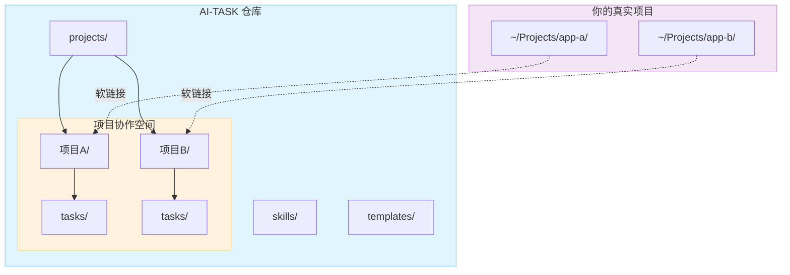

<div align="center">

# AI-TASK

**单人 · 多项目 · 跨设备的 AI 协作路书与任务管理系统**

[English](./README_EN.md) | 简体中文

[](https://github.com/ArnoFrost/AI-TASK/stargazers)
[](https://github.com/ArnoFrost/AI-TASK/network)
[](LICENSE)
[](CHANGELOG.md)
[](https://github.com/ArnoFrost/DDAC)

</div>

---

## 30 秒体验

**零摩擦使用：只需引入项目入口，然后描述任务**

```
步骤1: 在对话中引入 @projects/EXAMPLE/index.md
步骤2: 告诉 AI "帮我实现用户登录功能"
步骤3: 完成 — AI 自动创建任务文档、执行、更新状态
```

> 想先看效果？查看示例项目：[projects/EXAMPLE/](./projects/EXAMPLE/)（含进行中任务 + 归档示例）

---

## 什么是 AI-TASK？

AI-TASK 是一套**面向 AI 协作的文件系统约定**：用统一的目录结构、任务模板和技能系统，把你在多个项目中的 AI 协作过程沉淀为可复用的"路书"。

> AI-TASK 是 [DDAC](https://github.com/ArnoFrost/DDAC) 方法论的落地实现。详见 [docs/ARCHITECTURE.md](./docs/ARCHITECTURE.md#与-ddac-的关系)。

**适用**：单人（或极小团队）、多项目并行、跨设备切换、用 Markdown 沉淀协作过程。
**不适用**：强依赖看板/通知/权限/指派的团队协作。

---

## 核心概念（3 个）

| 概念 | 说明 |
|------|------|
| **`projects/{CODE}/`** | 每个项目的协作空间（任务、文档、归档、元数据） |
| **`ai-task.local/` 软链接** | 把协作空间挂载到你的真实项目根目录（全局 gitignore 忽略），AI 通过固定路径访问 |
| **`project.yaml`** | 记录同一项目在不同设备上的路径，跨设备迁移无需改配置 |

---

## 前置条件

- 支持 AI 协作的 IDE（Claude Code / CodeBuddy / Cursor 等）
- macOS 或 Linux（软链接支持最好，Windows 需额外配置）
- Git（可选，用于版本管理）

---

## 快速开始（3 分钟）

### 方式一：AI 一键初始化（推荐）

在 AI 助手中说：

> 帮我安装并初始化 AI-TASK 协作系统
> 仓库地址：https://github.com/ArnoFrost/AI-TASK

或直接执行：

```bash
curl -fsSL https://raw.githubusercontent.com/ArnoFrost/AI-TASK/main/setup.sh | bash
```

AI 会自动完成：克隆仓库 → 选择安装路径 → 初始化项目 → 注入技能

### 方式二：手动安装

1. **克隆仓库**

   ```bash
   git clone https://github.com/ArnoFrost/AI-TASK.git ~/AI-TASK
   ```

2. **初始化项目空间**

   ```bash
   cd ~/AI-TASK
   ./init-project.sh
   ```

3. **开始协作** — 在 AI 助手中引入项目入口：

   ```
   @projects/MYAPP/index.md
   帮我实现用户登录功能
   ```

4. **注入开源技能**（可选）

   ```bash
   ./install-skills.sh
   ```

> 斜杠命令通过个人技能库扩展，详见 [skills/README.md](./skills/README.md)

---

## 架构设计


```mermaid
graph TB
    subgraph REPO["AI-TASK 仓库"]
        direction TB
        PROJECTS["projects/"]
        SKILLS["skills/"]
        TEMPLATES["templates/"]

        subgraph SPACES["项目协作空间"]
            P1["项目A/"] --> P1T["tasks/"]
            P2["项目B/"] --> P2T["tasks/"]
        end

        PROJECTS --> P1
        PROJECTS --> P2
    end

    subgraph REAL["你的真实项目"]
        EXT1["~/Projects/app-a/"]
        EXT2["~/Projects/app-b/"]
    end

    EXT1 -.->|"软链接"| P1
    EXT2 -.->|"软链接"| P2

    style REPO fill:#e1f5fe,stroke:#90caf9
    style SPACES fill:#fff3e0,stroke:#ffcc80
    style REAL fill:#f3e5f5,stroke:#ce93d8
```

> 完整架构说明、目录结构详解、软链接原理、任务标签列表 → [docs/ARCHITECTURE.md](./docs/ARCHITECTURE.md)

---

## 文档导航

| 文档 | 职责 |
|------|------|
| **[README.md](./README.md)** | 快速入门、核心概念、快速开始 |
| **[SPEC.md](./SPEC.md)** | 完整规范（Single Source of Truth） |
| **[docs/ARCHITECTURE.md](./docs/ARCHITECTURE.md)** | 架构原理、目录结构、软链接、标签体系 |
| **[CONTRIBUTING.md](./CONTRIBUTING.md)** | 贡献指南、开源边界 |
| **[CHANGELOG.md](./CHANGELOG.md)** | 版本历史与更新内容 |
| **[skills/](./skills/)** | 技能系统（开源技能 + 规范参考） |

---

## 已知局限

- **跨设备同步冲突**：避免同时编辑同一任务文件；冲突副本以任务编号为准手动合并
- **软链接跨平台差异**：macOS/Linux 体验最好，Windows 可能需要额外权限
- **不是团队任务平台**：偏"个人工作台 + 路书沉淀"，无看板/权限/指派

---

## 贡献

欢迎贡献！请参阅 [CONTRIBUTING.md](./CONTRIBUTING.md)。

## 许可证

MIT License — 详见 [LICENSE](LICENSE)。

---

<div align="center">

Made with ❤️ by [ArnoFrost](https://github.com/ArnoFrost)

</div>
