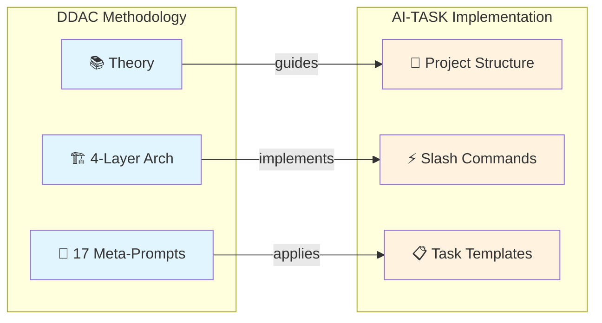
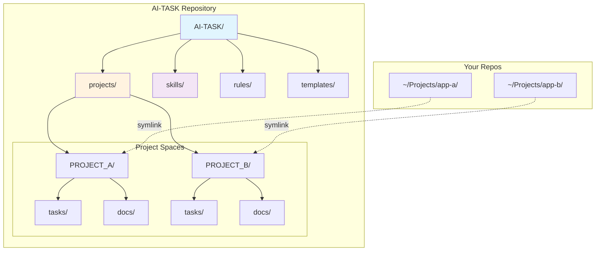

<div align="center">

# AI-TASK

**A file/template-driven AI collaboration roadmap + task system for solo developers across many projects and devices**

English | [简体中文](./README.md)

[](https://github.com/ArnoFrost/AI-TASK/stargazers)
[](https://github.com/ArnoFrost/AI-TASK/network)
[](https://github.com/ArnoFrost/AI-TASK/commits)
[](LICENSE)
[](CHANGELOG.md)
[](https://github.com/ArnoFrost/DDAC)

<p>
  <a href="#-quick-start">Quick Start</a> •
  <a href="#-architecture">Architecture</a> •
  <a href="./SPEC.md">Spec</a> •
  <a href="./CHANGELOG.md">Changelog</a>
</p>

</div>

---

<details>
<summary>📖 Table of Contents</summary>

- [30-Second Demo](#-30-second-demo)
- [What is AI-TASK](#-what-is-ai-task)
- [Key Concepts](#-key-concepts-3-things)
- [Quick Start](#-quick-start)
- [Architecture](#-architecture)
- [Directory Structure](#-directory-structure)
- [Known Limitations](#️-known-limitations-stay-small--sharp)
- [Contributing](#-contributing)

</details>

---

## ⚡ 30-Second Demo

**Don't want to read docs? Copy this to your AI assistant:**

```
Please create a task document using AI-TASK format:
- Project: DEMO
- Tag: [feature]
- Task: User Login Module
- Goals: 1. Login form UI  2. Form validation  3. API integration

Reference: https://github.com/ArnoFrost/AI-TASK/blob/main/projects/EXAMPLE/tasks/20260101-001_%5B功能%5D用户登录模块.md
```

AI will generate a standardized task document ✅ → This is the core value of AI-TASK: **Make AI output reusable collaboration documents in a unified format**

---

## 🎯 What is AI-TASK?

AI-TASK is a **file-system convention for AI collaboration**. It standardizes where your AI workflow artifacts live (tasks, designs, investigation notes, validations, conclusions) via a consistent directory structure, templates, Rules, and Skills—so you can reuse the same collaboration playbook across multiple projects.

> 💡 **Relationship with DDAC**: AI-TASK is a **practical implementation** of the [DDAC (Document-Driven AI Collaboration)](https://github.com/ArnoFrost/DDAC) methodology. DDAC defines the theoretical framework and four-layer architecture for document-driven AI collaboration, while AI-TASK is an MVP that applies these principles to "solo developer, multi-project task management". For the design philosophy, see DDAC; to get started hands-on, start here.



It is designed primarily for **solo developers** who work on many repositories and switch between devices (e.g., iCloud/drive sync), and want their AI assistant to follow the same workflow everywhere.

### Key features

| Feature | Description |
|:---:|---|
| 🗂️ | **Per-project space** - Each project lives under `projects/{CODE}/` |
| 🔗 | **Symlink integration** - Non-invasive via `ai-task/` mount point |
| 📱 | **Cross-device sync** - `project.yaml` supports multi-device paths |
| 🤖 | **AI native** - Built-in slash commands for CodeBuddy/Claude Code |
| 📐 | **Template-driven** - Consistent, predictable AI output |

### Fits / Doesn't fit

- **Fits**: solo (or tiny teams), multi-project, cross-device, willing to write structured Markdown.
- **Doesn't fit**: teams needing boards/notifications/permissions/assignments and platform-grade workflows.

---

## 🧠 Key Concepts (3 things)

- **`projects/{CODE}/`**: the per-project collaboration space (tasks/docs/archive/metadata).
- **`ai-task/` symlink**: a mount point inside your real repo so the AI can always find the same paths.
- **`project.yaml` multi-device paths**: list the same project's paths across devices.

### 🔄 DDAC Self-Governance

AI-TASK follows the self-governance principles of [DDAC methodology](https://github.com/ArnoFrost/DDAC):

| Principle | Description |
|-----------|-------------|
| **Project Self-Space** | `projects/{PROJECT}/` manages its own tasks |
| **Tasks Must Be Documented** | Discussion plans → `tasks/` task documents |
| **Status Must Be Updated** | Task completion → update `index.md` task list |

**Task Documentation Triggers** (create task if any applies):
- User proposes multi-step optimization/improvement plan
- User includes `@projects/{PROJECT}/index.md` context
- Discussion involves 3+ file modifications
- User mentions "plan", "design", "proposal", "improve"

See [SPEC.md#ddac-self-governance](./SPEC.md#-ddac-自治理规范) for details.

---

## 🚀 Quick Start

### 1) Clone

```bash
git clone https://github.com/ArnoFrost/AI-TASK.git ~/AI-TASK
```

### 2) Initialize a project space

```bash
cd ~/AI-TASK
./init-project.sh MYAPP "My App" "/Users/xxx/Projects/myapp" "React, TypeScript"

# Or interactive mode
./init-project.sh
```

### 3) Use commands in your AI assistant

```
/task create [feature] User Login Module
/task list
/status
```

---

## 📐 Architecture



---

## 📂 Directory Structure

```text
AI-TASK/
├── README.md
├── README_EN.md
├── SPEC.md
├── init-project.sh
├── projects/
│   └── {PROJECT}/
│       ├── project.yaml
│       ├── index.md
│       ├── tasks/
│       ├── docs/
│       └── archive/ (optional)
├── skills/
├── rules/
├── templates/
└── .codebuddy/commands/
```

---

## ⚠️ Known limitations (stay small & sharp)

- **Cross-device sync conflicts**: avoid editing the same task file on two devices at the same time; if your drive creates conflict copies, merge manually.
- **Symlink differences**: best on macOS/Linux; Windows may require extra permissions/modes.
- **Not a team task platform**: no boards/permissions/assignments.

---

## 🤝 Contributing

Contributions are welcome! Please feel free to submit a Pull Request.

## 📄 License

This project is licensed under the MIT License - see the [LICENSE](LICENSE) file for details.

## 📝 Changelog

See [CHANGELOG.md](CHANGELOG.md) for version history and updates.

---

<div align="center">

Made with ❤️ by [ArnoFrost](https://github.com/ArnoFrost)

[](https://github.com/ArnoFrost)

</div>
