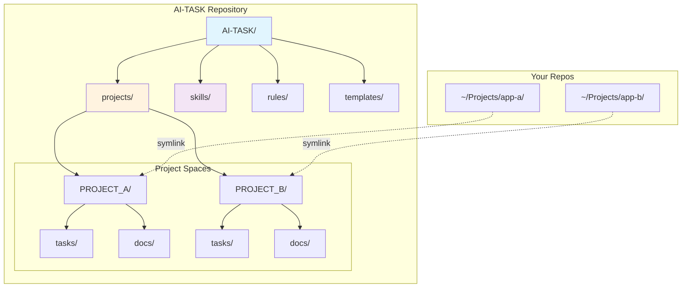

<div align="center">

# AI-TASK

**A file/template-driven AI collaboration roadmap + task system for a solo developer across many projects and devices**

English | [简体中文](./README.md)

[](LICENSE)
[](CHANGELOG.md)

</div>

---

## 🎯 What is AI-TASK?

AI-TASK is a **file-system convention for AI collaboration**. It standardizes where your AI workflow artifacts live (tasks, designs, investigation notes, validations, conclusions) via a consistent directory structure, templates, Rules, and Skills—so you can reuse the same collaboration playbook across multiple projects.

It is designed primarily for **solo developers** who work on many repositories and switch between devices (e.g., iCloud/drive sync), and want their AI assistant to follow the same workflow everywhere.

### Key features

- **Per-project collaboration space**: each project lives under `projects/{CODE}/` with tasks/docs/archive/metadata.
- **Cross-device consistency**: `project.yaml` can list multiple device paths.
- **Non-invasive integration**: mount the collaboration space into any existing repo via an `ai-task/` symlink.
- **More predictable AI output**: consistent task templates and naming conventions.
- **IDE/assistant adapters**: built-in slash-command templates for CodeBuddy/Claude Code (e.g., `/task`, `/status`, `/archive`).

### Fits / Doesn’t fit

- **Fits**: solo (or tiny teams), multi-project, cross-device, willing to write structured Markdown.
- **Doesn’t fit**: teams needing boards/notifications/permissions/assignments and platform-grade workflows.

---

## 🧠 Key Concepts (3 things)

- **`projects/{CODE}/`**: the per-project collaboration space (tasks/docs/archive/metadata).
- **`ai-task/` symlink**: a mount point inside your real repo so the AI can always find the same paths.
- **`project.yaml` multi-device paths**: list the same project’s paths across devices.

---

## 🚀 Quick Start

### 1) Clone

```bash
git clone https://github.com/ArnoFrost/AI-TASK.git ~/AI-TASK
```

### 2) Initialize a project space

```bash
cd ~/AI-TASK
./init-project.sh MYAPP "My App" "/Users/xxx/Projects/myapp" "React, TypeScript"

# Or interactive mode
./init-project.sh
```

### 3) Use commands in your AI assistant

```
/task create [feature] User Login Module
/task list
/status
```

---

## 📐 Architecture



---

## 📂 Directory Structure

```text
AI-TASK/
├── README.md
├── README_EN.md
├── SPEC.md
├── init-project.sh
├── projects/
│   └── {PROJECT}/
│       ├── project.yaml
│       ├── index.md
│       ├── tasks/
│       ├── docs/
│       └── archive/ (optional)
├── skills/
├── rules/
├── templates/
└── .codebuddy/commands/
```

---

## ⚠️ Known limitations (stay small & sharp)

- **Cross-device sync conflicts**: avoid editing the same task file on two devices at the same time; if your drive creates conflict copies, merge manually.
- **Symlink differences**: best on macOS/Linux; Windows may require extra permissions/modes.
- **Not a team task platform**: no boards/permissions/assignments.

---

## 🤝 Contributing

Contributions are welcome! Please feel free to submit a Pull Request.

## 📄 License

This project is licensed under the MIT License - see the [LICENSE](LICENSE) file for details.

## 📝 Changelog

See [CHANGELOG.md](CHANGELOG.md) for version history and updates.

---

<div align="center">

Made with ❤️ for AI-assisted development

</div>
