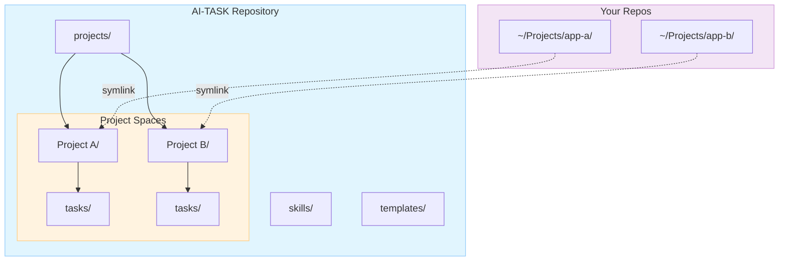

<div align="center">

# AI-TASK

**Solo developer · Multi-project · Cross-device AI collaboration roadmap & task management**

English | [简体中文](./README.md)

[](https://github.com/ArnoFrost/AI-TASK/stargazers)
[](https://github.com/ArnoFrost/AI-TASK/network)
[](LICENSE)
[](CHANGELOG.md)
[](https://github.com/ArnoFrost/DDAC)

</div>

---

## 30-Second Demo

**Zero friction: just include the project entry, then describe your task**

```
Step 1: Include @projects/EXAMPLE/index.md in your AI conversation
Step 2: Tell AI "Help me implement user login"
Step 3: Done — AI auto-creates task docs, executes, updates status
```

> Want to see it in action? Check the example project: [projects/EXAMPLE/](./projects/EXAMPLE/) (with in-progress task + archive sample)

---

## What is AI-TASK?

AI-TASK is a **file-system convention for AI collaboration**: it uses a consistent directory structure, task templates, and skill system to turn your AI collaboration artifacts across multiple projects into reusable "playbooks".

> AI-TASK is a practical implementation of the [DDAC](https://github.com/ArnoFrost/DDAC) methodology. See [docs/ARCHITECTURE.md](./docs/ARCHITECTURE.md#与-ddac-的关系) for details.

**Fits**: solo (or tiny teams), multi-project, cross-device, structured Markdown workflows.
**Doesn't fit**: teams needing boards/notifications/permissions/assignments.

---

## Key Concepts (3 things)

| Concept | Description |
|---------|-------------|
| **`projects/{CODE}/`** | Per-project collaboration space (tasks, docs, archive, metadata) |
| **`ai-task/` symlink** | Mounts the collaboration space into your real project root |
| **`project.yaml`** | Records project paths across devices for seamless migration |

---

## Prerequisites

- An AI-capable IDE (Claude Code / CodeBuddy / Cursor, etc.)
- macOS or Linux (best symlink support; Windows needs extra configuration)
- Git (optional, for version management)

---

## Quick Start (3 minutes)

### 1. Clone

```bash
git clone https://github.com/ArnoFrost/AI-TASK.git ~/AI-TASK
```

### 2. Initialize a project space

```bash
cd ~/AI-TASK

# Interactive mode (recommended)
./init-project.sh

# Or with arguments
./init-project.sh myapp --name "My App" --path "/path/to/myapp" --tech "React,TS"
```

### 3. Start collaborating

Include the project entry in your AI assistant:

```
@projects/MYAPP/index.md
Help me implement user login
```

### 4. Install open-source skills (optional)

```bash
./install-skills.sh
```

> Slash commands are managed via personal skill libraries. See [skills/README.md](./skills/README.md)

---

## Architecture


```mermaid
graph TB
    subgraph REPO["AI-TASK Repository"]
        direction TB
        PROJECTS["projects/"]
        SKILLS["skills/"]
        TEMPLATES["templates/"]

        subgraph SPACES["Project Spaces"]
            P1["Project A/"] --> P1T["tasks/"]
            P2["Project B/"] --> P2T["tasks/"]
        end

        PROJECTS --> P1
        PROJECTS --> P2
    end

    subgraph REAL["Your Repos"]
        EXT1["~/Projects/app-a/"]
        EXT2["~/Projects/app-b/"]
    end

    EXT1 -.->|"symlink"| P1
    EXT2 -.->|"symlink"| P2

    style REPO fill:#e1f5fe,stroke:#90caf9
    style SPACES fill:#fff3e0,stroke:#ffcc80
    style REAL fill:#f3e5f5,stroke:#ce93d8
```

> Full architecture details, directory structure, symlink mechanics, task tags → [docs/ARCHITECTURE.md](./docs/ARCHITECTURE.md)

---

## Documentation

| Document | Purpose |
|----------|---------|
| **[README.md](./README.md)** | Quick start, core concepts |
| **[SPEC.md](./SPEC.md)** | Full specification (Single Source of Truth) |
| **[docs/ARCHITECTURE.md](./docs/ARCHITECTURE.md)** | Architecture, directory structure, symlinks, tags |
| **[CONTRIBUTING.md](./CONTRIBUTING.md)** | Contribution guide, open-source boundaries |
| **[CHANGELOG.md](./CHANGELOG.md)** | Version history |
| **[skills/](./skills/)** | Skill system (open-source skills + spec references) |

---

## Known Limitations

- **Cross-device sync conflicts**: avoid editing the same task file on two devices; merge conflict copies manually
- **Symlink cross-platform differences**: best on macOS/Linux; Windows may require extra permissions
- **Not a team task platform**: designed for personal workbench + playbook documentation

---

## Contributing

Contributions are welcome! See [CONTRIBUTING.md](./CONTRIBUTING.md).

## License

MIT License — see [LICENSE](LICENSE).

---

<div align="center">

Made with ❤️ by [ArnoFrost](https://github.com/ArnoFrost)

</div>
