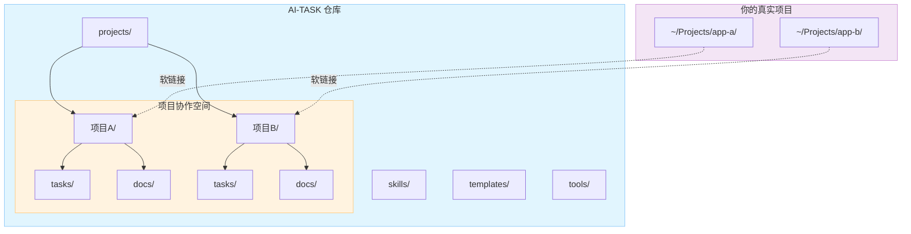
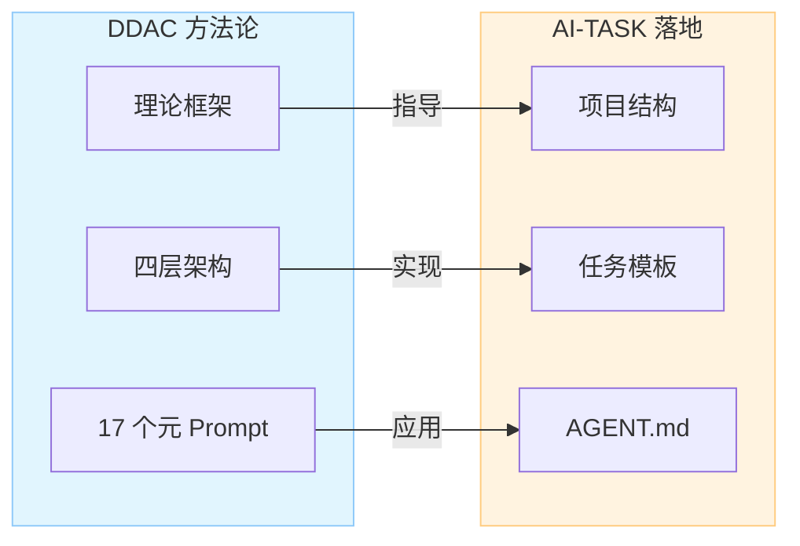
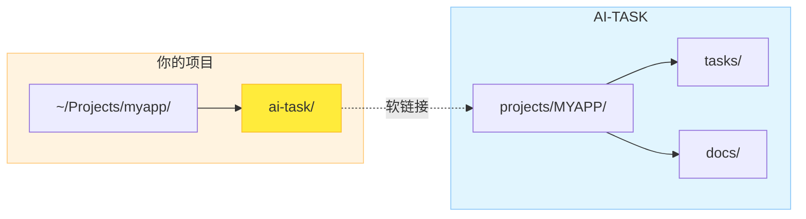

# AI-TASK 架构设计

> 本文档详细介绍 AI-TASK 的架构原理、目录结构、软链接机制和任务标签体系。
> 快速上手请看 [README.md](../README.md)，完整规范请看 [SPEC.md](../SPEC.md)。

---

## 架构概览



---

## 与 DDAC 的关系

AI-TASK 是 [DDAC (Document-Driven AI Collaboration)](https://github.com/ArnoFrost/DDAC) 方法论的落地实现。DDAC 定义了四层架构：

| DDAC 层级 | AI-TASK 对应 | 说明 |
|-----------|-------------|------|
| **方法论层** | SPEC.md | 规范定义、自治理原则 |
| **模板层** | templates/ | 项目元数据、任务模板、入口模板 |
| **规范层** | skills/ + rules/ | 技能系统、项目规则 |
| **实践层** | projects/{CODE}/ | 每个项目的实际协作空间 |



---

## 目录结构详解

```text
AI-TASK/
├── README.md                 # 快速入门
├── README_EN.md              # English version
├── SPEC.md                   # 完整规范（Single Source of Truth）
├── AGENT.md / CODEBUDDY.md   # AI 协作入口（IDE 适配）
├── init-project.sh           # 项目初始化脚本（交互式多 IDE）
├── install-skills.sh         # 开源技能全局注入脚本
├── relink.sh                 # 软链接重建脚本
├── projects/                 # 项目协作空间目录
│   ├── EXAMPLE/              # 示例项目（公开）
│   │   ├── project.yaml      # 项目元数据（含跨设备路径）
│   │   ├── index.md          # 项目入口（任务列表）
│   │   ├── README.md         # 协作规范
│   │   ├── tasks/            # 进行中的任务文件
│   │   ├── docs/             # 项目文档
│   │   └── archive/          # 已完成任务归档
│   └── AI-TASK/              # AI-TASK 自治空间（不公开）
├── skills/                   # 开源技能 + SKILL.md 规范参考
├── rules/                    # 项目规则
├── templates/                # 核心模板库
│   ├── AGENT.md              # 通用 AI 协作入口模板
│   ├── project.yaml          # 项目元数据模板
│   ├── project-index.md      # 项目入口模板
│   ├── task-template.md      # 任务文档模板
│   └── review-actions.yaml   # 评审行动项 schema
├── tools/                    # 工具脚本
│   ├── validate_obsidian.py  # Obsidian 格式校验
│   └── relink.sh → ../relink.sh
└── docs/                     # 架构与原理文档
    └── ARCHITECTURE.md       # 本文件
```

---

## 软链接工作原理

AI-TASK 通过软链接将协作空间"挂载"到你的真实项目中：



### 创建软链接

```bash
# 方式一：通过 init-project.sh（推荐）
./init-project.sh myapp --path ~/Projects/myapp

# 方式二：手动创建
ln -s "~/AI-TASK/projects/MYAPP" "~/Projects/myapp/ai-task"

# 方式三：批量重建（多项目）
cp relink.local.sh.example relink.local.sh
# 编辑 relink.local.sh 添加项目映射
./relink.sh
```

### 工作效果

- AI 助手通过 `ai-task/tasks/` 访问任务文件
- 无侵入式集成（只有一个软链接）
- 在多个项目间复用同一套协作模板与规范
- 跨设备迁移时只需重建软链接（`./relink.sh`）

---

## 任务标签完整列表

| 标签 | 用途 | 标签 | 用途 |
|------|------|------|------|
| `[功能]` | 新功能开发 | `[优化]` | 性能/体验优化 |
| `[修复]` | Bug 修复 | `[排查]` | 问题分析定位 |
| `[文档]` | 文档编写 | `[调研]` | 技术调研 |
| `[技术方案]` | 方案设计 | `[规范]` | 规范制定 |
| `[下线]` | 功能下线 | `[清理]` | 代码清理 |
| `[梳理]` | 逻辑梳理 | `[测试]` | 测试相关 |
| `[评审]` | 代码/方案评审 | `[架构]` | 架构设计/重构 |
| `[集成]` | 模块/系统集成 | `[同步]` | 技术摘要同步 |

**约束**：每个任务必须且只能使用 1 个标签，AI 不得自行创造新标签。详见 [SPEC.md#标签类型](../SPEC.md#标签类型)。

---

## DDAC 自治理

AI-TASK 遵循 DDAC 方法论的自治理原则：

| 原则 | 说明 |
|------|------|
| **项目自治空间** | `projects/{PROJECT}/` 管理自身任务 |
| **任务必须沉淀** | 讨论产生的计划 → `tasks/` 任务文档 |
| **状态必须更新** | 任务完成 → 更新 `index.md` 任务列表 |

**自动化行为**（引入 `index.md` 后 AI 自动执行）：

| 行为 | 说明 |
|------|------|
| 自动创建任务 | 用户描述需求 → AI 自动生成任务文档 |
| 自动命名编号 | `{DATE}-{SEQ}_[标签]名称.md`，用户无需关心 |
| 自动判断标签 | 根据任务内容智能选择 |
| 自动更新状态 | 任务完成 → 更新 `index.md` 任务列表 |

详见 [SPEC.md#ddac-自治理规范](../SPEC.md#-ddac-自治理规范)。
